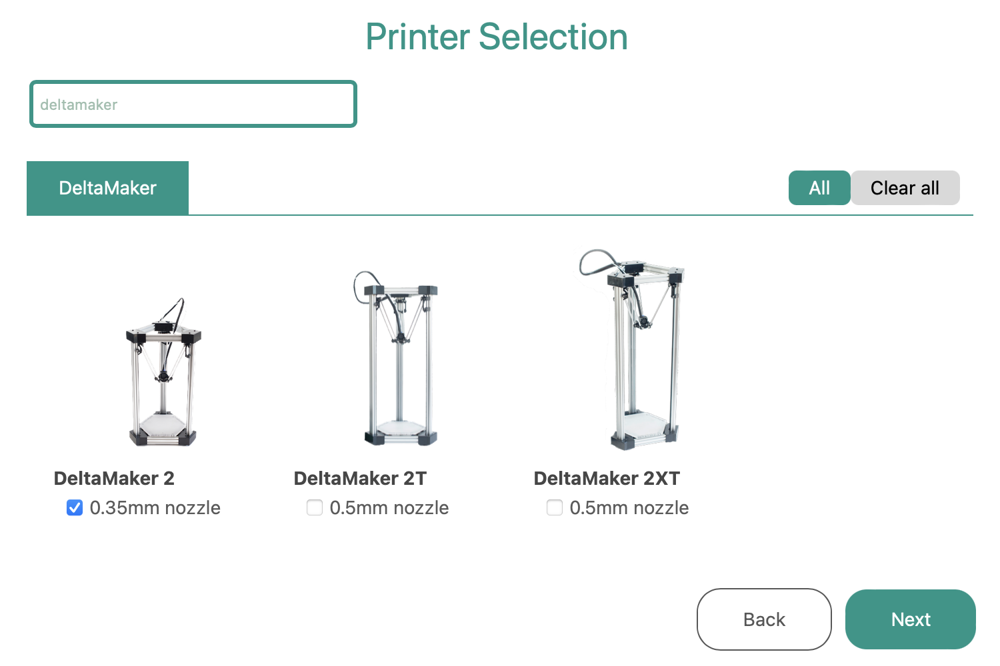

# Introduction
This repository contains the files required by the Orca Slicer Setup Wizard to install the printer profiles for DeltaMaker 3D printers.



# Installation
1. Download and install Orca Slicer from the official Orca Slicer GitHub repository.

    https://github.com/SoftFever/OrcaSlicer/releases

2. Download the respository files as a Zip file [(Code > Download Zip)](https://github.com/DeltaMaker/deltamaker-orcaslicer-profile/archive/refs/heads/main.zip) and extract the DeltaMaker profile (DeltaMaker.json file and DeltaMaker directory).
```
deltamaker-orcaslicer-profile/
├── profiles/
│   ├── DeltaMaker.json     (main configuration file)
│   ├── DeltaMaker/         (directory with configuration files)
```

3. 	Locate Orca Slicer’s Profiles Directory:
	Windows:
	- Navigate to the installation directory, typically, 
        C:\Program Files\OrcaSlicer\resources\profiles\

	MacOS:
	- Right-click the Orca Slicer application in the Applications folder and select “Show Package Contents”.
	- Navigate to:
        Contents/Resources/profiles/

4.  Copy the extracted DeltaMaker.json file and DeltaMaker directory into the profiles directory you located in the previous step.

5.  Ensure that the Orca Slicer profiles directory now contains:
```
        profiles/
        ├── DeltaMaker.json
        ├── DeltaMaker/
        ├── [Other manufacturer JSON files and directories]
```
# Launching Orca Slicer and Initial Setup
Run the Orca Slicer application and select a DeltaMaker 3D printer from the Setup Wizard.

